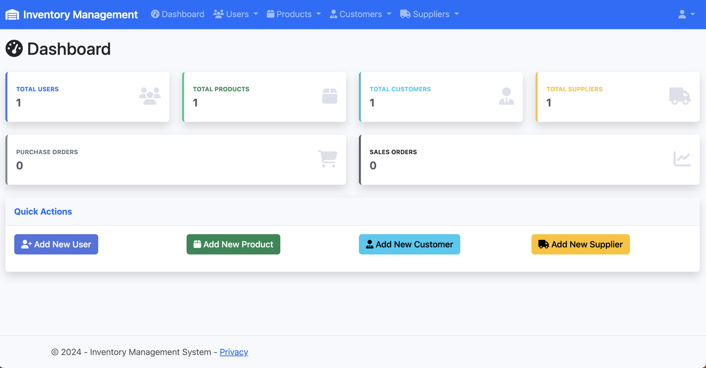
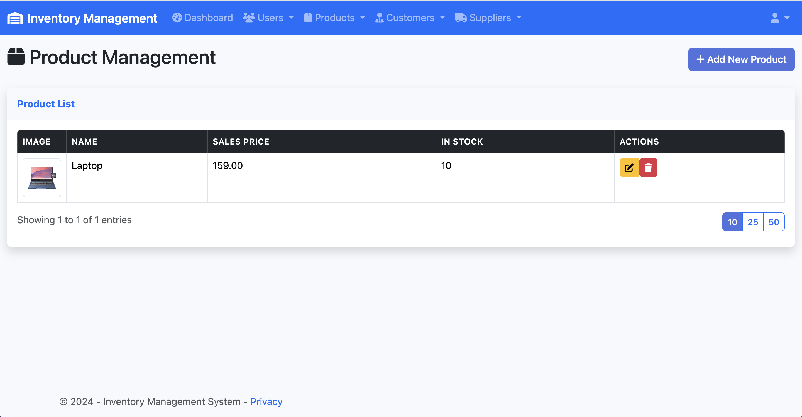
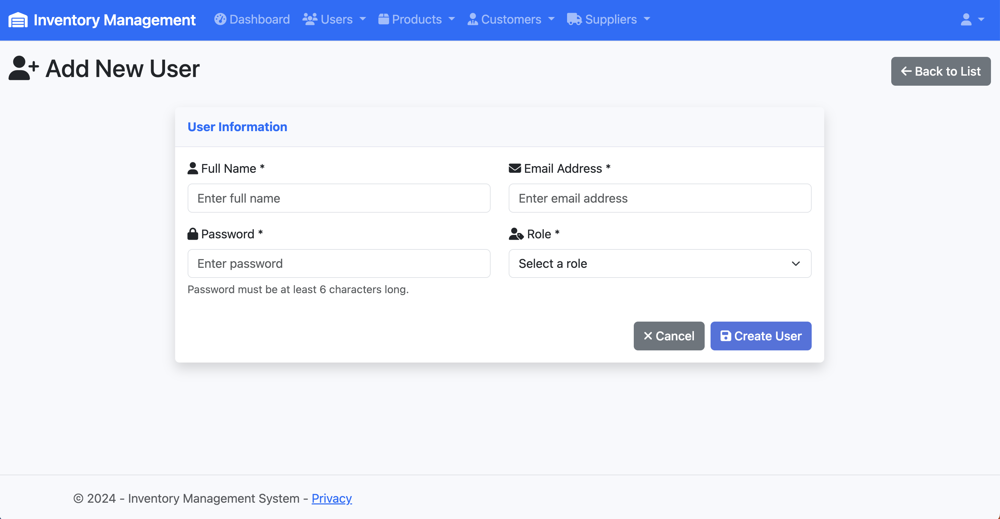
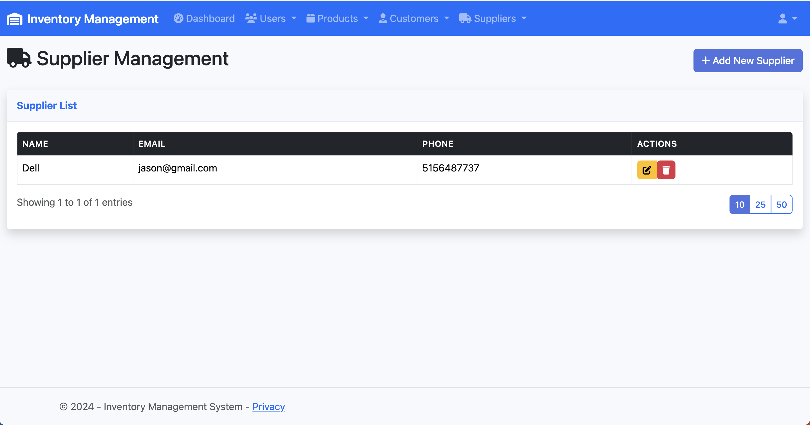
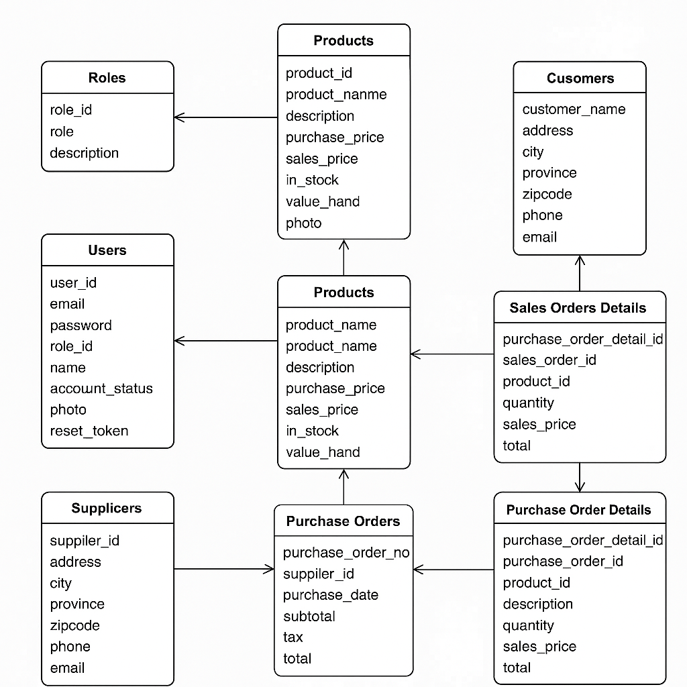
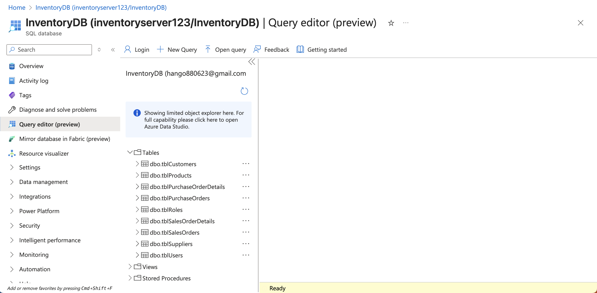

# Inventory Management System

A modern .NET 8 web application for managing inventory, users, customers, suppliers, and orders.

## Screenshots

### 📊 Dashboard
  
Clean dashboard view showing key statistics, navigation shortcuts, and recent activity.

### 📦 Product Management
  
Product list with pagination, image thumbnails, and CRUD controls.

### 👤 User Management
  
User creation form with role assignment, validation, and secure password handling.

### 🏭 Supplier Management
  
Supplier list with quick access to details, pagination, and management actions.

### 🗄️ Database Schema
  
SQL Server schema and role seeding configuration for first-time setup.

### 🗄️ Database Setup
  
Azure SQL setup.

## Features

### ✅ Completed Features
- **Database Setup**: Azure SQL Server integration with Entity Framework Core
- **Authentication System**: Cookie-based auth for MVC + JWT for APIs; role-based authorization
- **User Management**: Complete CRUD with pagination and delete confirmation modal
- **Product Management**: CRUD, image upload + thumbnail in list, pagination
- **Customer Management**: CRUD with pagination
- **Supplier Management**: CRUD with pagination
- **Dashboard**: Statistics overview with quick actions
- **Login/Registration**: Secure login and self-service registration with BCrypt password hashing
- **Responsive UI**: Modern Bootstrap 5 interface with Font Awesome icons
- **Toast Notifications**: Custom alert system for user feedback
- **Data Validation**: Client and server-side validation
- **Pagination**: Efficient data loading with configurable page sizes

### 🚧 In Progress
- Order Management (Purchase & Sales)

## Prerequisites

- .NET 8 SDK
- Azure SQL Server database
- Visual Studio 2022 or VS Code
- Git

## Setup Instructions

### 1. Database Configuration

1. **Update Connection String**: 
   - Open `appsettings.json`
   - Replace the connection string with your Azure SQL Server details:
   ```json
   "ConnectionStrings": {
     "DefaultConnection": "Server=inventoryserver123.database.windows.net;Database=InventoryDB;User Id=your_username;Password=your_password;TrustServerCertificate=true;"
   }
   ```

2. **Run Database Migration / Ensure DB**:
   - The app calls `EnsureCreated()` on startup to verify connectivity. For migrations:
     ```bash
     dotnet ef database update
     ```

3. **Seed Required Roles (if missing)**:
   - If you encounter FK errors on user insert (role not found), run:
     ```sql
     IF NOT EXISTS (SELECT 1 FROM dbo.tblRoles WHERE role = 'User')
     INSERT INTO dbo.tblRoles(role, description) VALUES ('User', 'Regular User');
     IF NOT EXISTS (SELECT 1 FROM dbo.tblRoles WHERE role = 'Admin')
     INSERT INTO dbo.tblRoles(role, description) VALUES ('Admin', 'System Administrator');
     ```

### 2. Install Dependencies

```bash
# Restore NuGet packages
dotnet restore

# Install client-side libraries (if using LibMan)
dotnet tool install -g Microsoft.Web.LibraryManager.Cli
libman restore
```

### 3. Run the Application

```bash
# Build the application
dotnet build

# Run the application
dotnet run
```

The application will be available at `http://localhost:5000`.

### 4. Default Login Credentials

- **Email**: admin@inventory.com
- **Password**: Admin123!

## Project Structure

```
InventoryManagementSystem/
├── Controllers/          # MVC Controllers
├── Data/                # Database context and configurations
├── Models/              # Entity models
├── Services/            # Business logic services
├── Views/               # Razor views
├── wwwroot/             # Static files (CSS, JS, images)
├── appsettings.json     # Configuration settings
└── Program.cs           # Application startup
```

## Database Schema

The system includes the following main entities:

- **Users**: System users with role-based access
- **Roles**: User roles (Admin, Manager, User)
- **Products**: Inventory items with pricing and stock
- **Customers**: Customer information
- **Suppliers**: Supplier information
- **Purchase Orders**: Incoming inventory orders
- **Sales Orders**: Outgoing customer orders

## Key Technologies

- **Backend**: .NET 8, ASP.NET Core MVC
- **Database**: Azure SQL Server, Entity Framework Core
- **Authentication**: Cookie authentication (default), JWT Bearer tokens (APIs)
- **Frontend**: Bootstrap 5, jQuery, Font Awesome
- **Security**: BCrypt password hashing
- **Logging**: Serilog with file output

## Endpoints

### Authentication
- `GET /Auth/Login` - Login page
- `POST /Auth/Login` - Authenticate user
- `GET /Auth/Register` - Register page
- `POST /Auth/Register` - Create new account and sign-in
- `POST /Auth/Logout` - Logout user

### User Management
- `GET /User` - User list with pagination
- `GET /User/Create` - Add new user form
- `POST /User/Create` - Create new user
- `GET /User/Edit/{id}` - Edit user form
- `POST /User/Edit` - Update user
- `POST /User/Delete/{id}` - Delete user

### Product Management
- `GET /Product` - Product list with pagination
- `GET /Product/Create` - Add product
- `POST /Product/Create` - Create product (supports image upload)
- `GET /Product/Edit/{id}` - Edit product
- `POST /Product/Edit` - Update product
- `POST /Product/Delete/{id}` - Delete product
- `GET /Product/Image/{id}` - Returns product image bytes

### Customer Management
- `GET /Customer` - Customer list with pagination
- `GET /Customer/Create` - Add customer
- `POST /Customer/Create` - Create customer
- `GET /Customer/Edit/{id}` - Edit customer
- `POST /Customer/Edit` - Update customer
- `POST /Customer/Delete/{id}` - Delete customer

### Supplier Management
- `GET /Supplier` - Supplier list with pagination
- `GET /Supplier/Create` - Add supplier
- `POST /Supplier/Create` - Create supplier
- `GET /Supplier/Edit/{id}` - Edit supplier
- `POST /Supplier/Edit` - Update supplier
- `POST /Supplier/Delete/{id}` - Delete supplier

### Dashboard
- `GET /Home` - Main dashboard with statistics

## Security Features

- Password hashing with BCrypt
- Role-based authorization
- Session management
- CSRF protection
- Input validation and sanitization
- Cookie authentication as default sign-in scheme for MVC

## Development Guidelines

### Adding New Features

1. **Models**: Add entity classes in `Models/` folder
2. **Services**: Create service interfaces and implementations
3. **Controllers**: Add MVC controllers with proper authorization
4. **Views**: Create Razor views with Bootstrap styling
5. **Database**: Update DbContext and run migrations

### Code Standards

- Use async/await for database operations
- Implement proper error handling
- Follow RESTful conventions
- Use dependency injection
- Write unit tests for services

## Troubleshooting

### Common Issues

1. **Database Connection Failed**:
   - Verify connection string in `appsettings.json`
   - Check Azure SQL Server firewall settings
   - Ensure database exists

2. **Migration Errors**:
   - Delete existing migrations folder
   - Run `dotnet ef migrations add InitialCreate`
   - Run `dotnet ef database update`

3. **Authentication Issues**:
   - Cookie auth: ensure `AddAuthentication().AddCookie("Cookies", ...)` is configured (Program.cs)
   - JWT: check JWT settings in `appsettings.json`
   - Verify user exists and password is hashed (BCrypt)
   - Ensure `accountstatus` is `Active`

4. **FK Role Error on Register**:
   - Insert required roles using the SQL in setup step 3.

## Contributing

1. Fork the repository
2. Create a feature branch
3. Make your changes
4. Add tests if applicable
5. Submit a pull request

## License

This project is licensed under the MIT License.

## Support

For support and questions, please contact the development team or create an issue in the repository.
